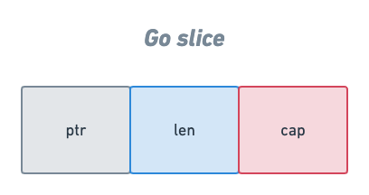

# Slice

Slicelar temelde arraylere benzerler ancak arraylerden <b>daha etkili ve esnek</b> bir veri tipidir.

```go
var slice []int
```

veya:

```go
slice := make([]int,5)
```

şeklinde tanımlanır.

## Slicelarin Yapısı

Slicelar temelde 3 farklı yapıdan oluşur:

- `ptr` - arrayi tutan işaretçi(*pointer*).
- `len` - slice'in uzunluğu - slice'daki eleman sayısı.
- `cap` - slice'in kapasitesi - işaretçide tutulan arrayin uzunluğu, ayrıca slice'in maksimum uzunluğu.

<p align="center">
    
</p>


## Değer Atama

Slicelarda değer eklerken arraylerden farklı olarak `append()` fonksiyonu kullanılır.

```go
slice := make([]int,5)

slice = append(slice,10) // slice'a 10 değerini ekleme
```


## Array ve Slice'in Farkı

- Arrayler sabit boyutludur, Slicelar ise dinamik boyutludur.

